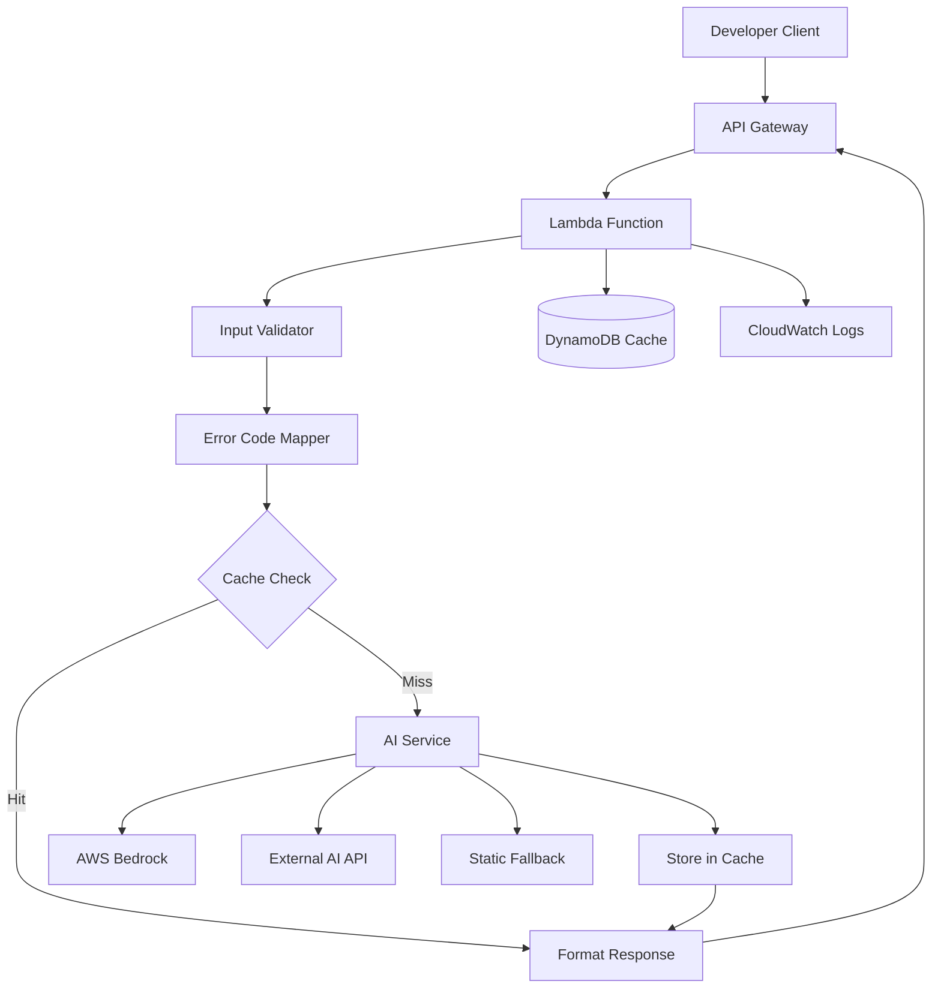
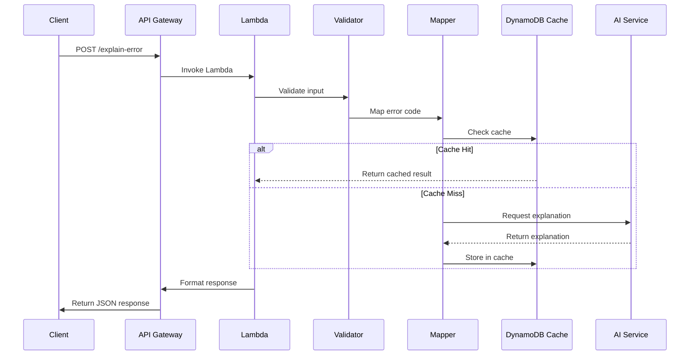

# Design Document

## Overview

The Solana Error Code Explanation API is a serverless backend service that transforms cryptic Anchor error codes into human-readable explanations with actionable fix suggestions. The system leverages AI models to provide contextual explanations while maintaining high performance through intelligent caching and fallback mechanisms.

### Key Design Principles

- **Serverless-first**: Built for AWS Lambda with automatic scaling
- **AI-enhanced**: Intelligent error explanation using large language models
- **Performance-optimized**: Sub-500ms response times with caching
- **Developer-focused**: Tailored explanations for Solana/Anchor development
- **Resilient**: Multiple fallback mechanisms for reliability

## Architecture

### High-Level Architecture



### Request Flow

1. **API Gateway** receives POST request to `/explain-error`
2. **Lambda Function** processes the request through:
   - Input validation and sanitization
   - Error code mapping (standard vs custom)
   - Cache lookup in DynamoDB
   - AI service integration (if cache miss)
   - Response formatting and caching
3. **Response** returned with explanation and fix suggestions

### Component Interaction



## Components and Interfaces

### 1. API Gateway Configuration

**Endpoint**: `POST /explain-error`

**Request Schema**:
```typescript
interface ErrorRequest {
  errorCode: number | string;
}
```

**Response Schema**:
```typescript
interface ErrorResponse {
  code: number;
  explanation: string;
  fixes: string[];
  cached?: boolean;
  timestamp: string;
}

interface ErrorResponseError {
  error: string;
  code: number;
  timestamp: string;
}
```

### 2. Lambda Function Structure

```typescript
// Main handler interface
export interface LambdaHandler {
  (event: APIGatewayProxyEvent, context: Context): Promise<APIGatewayProxyResult>;
}

// Core service interfaces
interface ErrorExplanationService {
  explainError(errorCode: number): Promise<ErrorExplanation>;
}

interface ErrorCodeMapper {
  mapToStandardError(code: number): StandardError | null;
  isCustomAnchorError(code: number): boolean;
}

interface CacheService {
  get(key: string): Promise<ErrorExplanation | null>;
  set(key: string, value: ErrorExplanation, ttl: number): Promise<void>;
}

interface AIService {
  generateExplanation(errorCode: number, context?: string): Promise<AIExplanation>;
}
```

### 3. Error Code Mapping System

**Standard Solana Errors (0-9999)**:
```typescript
const STANDARD_SOLANA_ERRORS: Record<number, StandardError> = {
  0: { name: 'Success', description: 'No error occurred' },
  1: { name: 'InvalidInstructionData', description: 'The instruction data is invalid' },
  100: { name: 'InstructionMissing', description: 'Required instruction is missing' },
  // ... additional mappings
};
```

**Anchor Constraint Errors (2000-2999)**:
```typescript
const ANCHOR_CONSTRAINT_ERRORS: Record<number, AnchorError> = {
  2000: { name: 'ConstraintSeeds', description: 'Seeds constraint violation' },
  2001: { name: 'ConstraintHasOne', description: 'HasOne constraint violation' },
  // ... additional mappings
};
```

**Custom Error Range (6000+)**:
- Treated as program-specific errors
- Processed through AI inference
- Cached with program context when available

### 4. AI Integration Layer

**Primary Provider: AWS Bedrock**
```typescript
interface BedrockConfig {
  modelId: string; // e.g., 'anthropic.claude-3-sonnet-20240229-v1:0'
  region: string;
  maxTokens: number;
  temperature: number;
}

interface BedrockService extends AIService {
  invokeModel(prompt: string, config: BedrockConfig): Promise<string>;
}
```

**Fallback Provider: External API**
```typescript
interface ExternalAIConfig {
  apiUrl: string;
  apiKey: string;
  model: string;
  timeout: number;
}
```

**AI Prompt Template**:
```typescript
const ERROR_EXPLANATION_PROMPT = `
You are a Solana blockchain developer assistant. Explain the following Anchor error code in simple terms and provide 2-3 practical fix suggestions.

Error Code: {errorCode}
Context: {context}

Format your response as:
Explanation: [Brief, clear explanation of what this error means]
Fix 1: [Specific actionable suggestion]
Fix 2: [Alternative approach or additional check]
Fix 3: [Tool or debugging technique]

Focus on Solana/Anchor-specific solutions and mention relevant tools like 'anchor test', 'solana logs', or common pitfalls.
`;
```

### 5. Caching Strategy

**DynamoDB Table Schema**:
```typescript
interface CacheItem {
  errorCode: string; // Partition key
  explanation: string;
  fixes: string[];
  createdAt: number;
  ttl: number; // TTL attribute for automatic cleanup
  source: 'ai' | 'static' | 'mapped';
}
```

**Cache Key Strategy**:
- Primary key: `error_${errorCode}`
- TTL: 3600 seconds (1 hour)
- Conditional writes to prevent race conditions

## Data Models

### Core Data Types

```typescript
// Input validation model
interface ValidatedErrorCode {
  code: number;
  originalInput: string | number;
  type: 'standard' | 'anchor_constraint' | 'custom';
}

// Error explanation model
interface ErrorExplanation {
  code: number;
  explanation: string;
  fixes: string[];
  source: 'cache' | 'ai' | 'static';
  confidence?: number;
}

// Standard error mapping
interface StandardError {
  name: string;
  description: string;
  category: 'system' | 'instruction' | 'account' | 'program';
  commonCauses: string[];
  fixSuggestions: string[];
}

// AI response model
interface AIExplanation {
  explanation: string;
  fixes: string[];
  confidence: number;
  model: string;
  tokens: number;
}
```

### Environment Configuration

```typescript
interface EnvironmentConfig {
  // AI Configuration
  AWS_BEDROCK_REGION: string;
  AWS_BEDROCK_MODEL_ID: string;
  AI_TEMPERATURE: string;
  AI_MAX_TOKENS: string;
  AI_TIMEOUT_MS: string;
  
  // External AI Fallback
  EXTERNAL_AI_API_URL?: string;
  EXTERNAL_AI_API_KEY?: string;
  
  // Cache Configuration
  DYNAMODB_TABLE_NAME: string;
  CACHE_TTL_SECONDS: string;
  
  // Rate Limiting
  RATE_LIMIT_PER_MINUTE: string;
  
  // Logging
  LOG_LEVEL: string;
}
```

## Error Handling

### Error Categories and Responses

**1. Client Errors (4xx)**
```typescript
enum ClientErrorType {
  INVALID_INPUT = 'INVALID_INPUT',
  MISSING_FIELD = 'MISSING_FIELD',
  RATE_LIMITED = 'RATE_LIMITED',
  UNSUPPORTED_FORMAT = 'UNSUPPORTED_FORMAT'
}

const CLIENT_ERROR_RESPONSES = {
  [ClientErrorType.INVALID_INPUT]: {
    status: 400,
    message: 'Invalid error code format. Must be a number between 0 and 4294967295 or hex string.'
  },
  [ClientErrorType.MISSING_FIELD]: {
    status: 400,
    message: 'Missing required field: errorCode'
  },
  [ClientErrorType.RATE_LIMITED]: {
    status: 429,
    message: 'Rate limit exceeded. Please try again later.'
  }
};
```

**2. Server Errors (5xx)**
```typescript
enum ServerErrorType {
  AI_SERVICE_UNAVAILABLE = 'AI_SERVICE_UNAVAILABLE',
  CACHE_ERROR = 'CACHE_ERROR',
  INTERNAL_ERROR = 'INTERNAL_ERROR',
  TIMEOUT = 'TIMEOUT'
}

const SERVER_ERROR_RESPONSES = {
  [ServerErrorType.AI_SERVICE_UNAVAILABLE]: {
    status: 503,
    message: 'AI service temporarily unavailable. Using fallback explanation.'
  },
  [ServerErrorType.TIMEOUT]: {
    status: 504,
    message: 'Request timeout. Please try again.'
  }
};
```

### Fallback Mechanisms

**1. AI Service Fallback Chain**:
1. AWS Bedrock (primary)
2. External AI API (secondary)
3. Static error database (final fallback)

**2. Cache Fallback**:
1. DynamoDB cache lookup
2. In-memory cache (for Lambda warm starts)
3. Direct AI/static lookup

**3. Response Degradation**:
```typescript
interface FallbackResponse {
  code: number;
  explanation: string;
  fixes: string[];
  fallback: true;
  reason: string;
}
```

## Testing Strategy

### Unit Testing Approach

**1. Component Testing**
- Input validation logic
- Error code mapping functions
- AI service integration (mocked)
- Cache operations
- Response formatting

**2. Integration Testing**
- End-to-end API flow
- AWS service integrations
- Error handling scenarios
- Performance benchmarks

**3. Test Data Sets**

```typescript
const TEST_ERROR_CODES = {
  standard: [0, 1, 100, 200],
  anchorConstraints: [2000, 2001, 2002],
  custom: [6000, 6001, 7500],
  invalid: [-1, 4294967296, 'invalid', null]
};

const MOCK_AI_RESPONSES = {
  6000: {
    explanation: 'Custom program error indicating insufficient funds',
    fixes: [
      'Check account balance before transaction',
      'Verify token account has sufficient balance',
      'Add balance validation in your program logic'
    ]
  }
};
```

### Performance Testing

**Benchmarks**:
- Cold start: < 500ms
- Warm start: < 100ms
- Cache hit response: < 50ms
- AI response: < 2000ms
- Concurrent requests: 1000+ req/min

### Security Testing

**Test Scenarios**:
- Input injection attempts
- Rate limiting validation
- Authentication bypass attempts
- Large payload handling
- Malformed request handling

## Deployment Architecture

### AWS Infrastructure

**Lambda Configuration**:
```yaml
Runtime: nodejs20.x
Memory: 512MB
Timeout: 30s
Environment Variables: [from SSM Parameter Store]
VPC: None (public internet access for AI APIs)
Reserved Concurrency: 100
```

**API Gateway Configuration**:
```yaml
Type: REST API
Throttling: 1000 req/sec burst, 500 req/sec steady
CORS: Enabled for web clients
Request Validation: Enabled
Caching: Disabled (using DynamoDB instead)
```

**DynamoDB Configuration**:
```yaml
Table: solana-error-cache
Partition Key: errorCode (String)
Billing Mode: On-Demand
TTL Attribute: ttl
Point-in-time Recovery: Enabled
```

**IAM Roles and Policies**:
```json
{
  "Version": "2012-10-17",
  "Statement": [
    {
      "Effect": "Allow",
      "Action": [
        "bedrock:InvokeModel"
      ],
      "Resource": "arn:aws:bedrock:*:*:foundation-model/*"
    },
    {
      "Effect": "Allow",
      "Action": [
        "dynamodb:GetItem",
        "dynamodb:PutItem"
      ],
      "Resource": "arn:aws:dynamodb:*:*:table/solana-error-cache"
    }
  ]
}
```

### Monitoring and Observability

**CloudWatch Metrics**:
- Request count and latency
- Error rates by type
- AI service response times
- Cache hit/miss ratios
- Lambda cold start frequency

**Custom Metrics**:
```typescript
interface CustomMetrics {
  aiServiceLatency: number;
  cacheHitRate: number;
  errorCodeDistribution: Record<string, number>;
  fallbackUsage: number;
}
```

**Alerting**:
- Error rate > 5%
- Average latency > 1000ms
- AI service failures > 10%
- Cache errors > 1%

This design provides a robust, scalable, and maintainable solution for the Solana Error Code Explanation API, with comprehensive error handling, performance optimization, and monitoring capabilities.